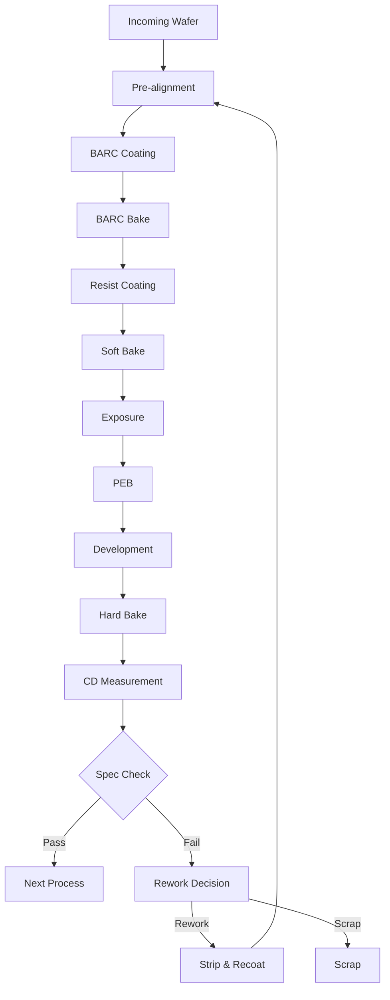

# ArF Immersion Lithography 공정 사양서
## 14nm Logic Device Critical Layer Patterning

**문서번호:** PS-LITHO-ARF-001-K  
**개정번호:** Rev. 3.2  
**작성일:** 2024년 11월 15일  
**보안등급:** Confidential  

---

## 1. 문서 헤더

### 승인 정보
| 역할 | 담당자 | 소속 | 서명 | 날짜 |
|------|--------|------|------|------|
| 작성 | 김성민 책임 | Photo 공정기술팀 | | |
| 검토 | 박지훈 수석 | Photo 공정기술팀 | | |
| 승인 | 김철수 팀장 | 공정기술팀 | | |
| 승인 | 박영희 팀장 | 품질팀 | | |
| 승인 | 이민호 팀장 | 생산팀 | | |

### 배포 리스트
- Photo 공정기술팀
- 품질관리팀
- 생산관리팀
- 장비기술팀
- 통합공정팀

---

## 2. 공정 개요

### 2.1 공정 목적
14nm logic device의 critical layer (Metal 1, Via 1, Poly gate) 패턴 형성을 위한 ArF immersion lithography 공정 사양을 정의합니다.

### 2.2 주요 사양
- **Technology Node:** 14nm FinFET
- **목표 CD (Critical Dimension):** 45 ± 2nm
- **Overlay Accuracy:** ≤ 3nm (3σ)
- **LER (Line Edge Roughness):** < 2.5nm (3σ)
- **Defect Density:** < 0.01 defects/cm²
- **처리량:** 120 WPH (Wafers Per Hour)

### 2.3 적용 장비
- **Scanner:** ASML NXT:2050i
- **Track:** TEL CLEAN TRACK ACT 12
- **Metrology:** KLA-Tencor SpectraCD 200
- **Inspection:** KLA 2935

---

## 3. 적용 제품 및 Layer

### 3.1 Product Matrix

| Product Code | Device Type | Technology | Volume |
|-------------|-------------|------------|---------|
| PRD-14L-001 | Logic | 14nm FinFET | High |
| PRD-14L-002 | SoC | 14nm FinFET | Medium |
| PRD-14L-003 | GPU | 14nm FinFET | High |
| PRD-14L-004 | AI Chip | 14nm FinFET | Low |

### 3.2 Critical Layers

| Layer Code | Layer Name | Pitch | CD Target | Overlay |
|------------|------------|-------|-----------|---------|
| M1 | Metal 1 | 64nm | 32nm | < 3nm |
| V1 | Via 1 | 64nm | 28nm | < 2.5nm |
| PG | Poly Gate | 54nm | 27nm | < 2nm |
| CT | Contact | 64nm | 32nm | < 3nm |
| M2 | Metal 2 | 64nm | 32nm | < 3nm |

---

## 4. 공정 Flow Chart

### Process Time Summary
| Step | Equipment | Time | Temp |
|------|-----------|------|------|
| BARC Coat | Track | 60s | 23°C |
| BARC Bake | Hot Plate | 60s | 205°C |
| Resist Coat | Track | 60s | 23°C |
| Soft Bake | Hot Plate | 60s | 110°C |
| Exposure | Scanner | 40s | 23°C |
| PEB | Hot Plate | 60s | 115°C |
| Development | Track | 60s | 23°C |
| Hard Bake | Hot Plate | 60s | 130°C |

---

## 5. 상세 공정 파라미터

### 5.1 BARC (Bottom Anti-Reflective Coating)

#### Material Specifications
- **Material:** AZ ArF-1C5D
- **Thickness Target:** 80 ± 2nm
- **Refractive Index:** n = 1.82, k = 0.35 @ 193nm
- **Storage Temperature:** 5 ± 2°C

#### Process Parameters
| Parameter | Set Point | Tolerance | Unit |
|-----------|-----------|-----------|------|
| Spin Speed | 1500 | ± 20 | rpm |
| Dispense Volume | 1.5 | ± 0.1 | mL |
| EBR Width | 2.0 | ± 0.1 | mm |
| Bake Temperature | 205 | ± 1 | °C |
| Bake Time | 60 | ± 1 | sec |
| Thickness Uniformity | < 1.5 | - | % |

### 5.2 Photoresist Coating

#### Resist Specifications
- **Type:** JSR AR2928JN (ArF Immersion)
- **Thickness Target:** 90 ± 2nm
- **Viscosity:** 4.5 cP @ 23°C
- **Solid Content:** 4.2%
- **Shelf Life:** 6 months @ 5°C

#### Coating Parameters
| Parameter | Set Point | Tolerance | Unit |
|-----------|-----------|-----------|------|
| Pre-wet | None | - | - |
| Dispense Volume | 1.0 | ± 0.05 | mL |
| Spread Speed | 500 | ± 10 | rpm |
| Spread Time | 3 | ± 0.5 | sec |
| Cast Speed | 1500 | ± 20 | rpm |
| Cast Acceleration | 10000 | ± 500 | rpm/s |
| Main Spin Speed | 3200 | ± 20 | rpm |
| Main Spin Time | 30 | ± 1 | sec |
| EBR Chemical | PGMEA | - | - |
| EBR Width | 1.5 | ± 0.1 | mm |

### 5.3 Exposure Parameters

#### Scanner Settings
| Parameter | Set Point | Tolerance | Unit |
|-----------|-----------|-----------|------|
| Wavelength | 193 | Fixed | nm |
| NA | 1.35 | Fixed | - |
| Sigma | 0.85/0.65 | ± 0.02 | - |
| Illumination | Annular | - | - |
| Dose | 28 | ± 0.5 | mJ/cm² |
| Focus Offset | +20 | ± 5 | nm |
| Immersion Fluid | H2O | - | - |
| Fluid Temperature | 23.0 | ± 0.1 | °C |
| Fluid Flow | 1.0 | ± 0.05 | L/min |

#### Reticle Information
- **Reticle ID:** M1-REV3-001
- **Magnification:** 4X
- **CD Bias:** -2nm
- **OPC Applied:** Yes
- **Pellicle:** 800nm thick

### 5.4 Post Exposure Bake (PEB)

| Parameter | Set Point | Tolerance | Unit |
|-----------|-----------|-----------|------|
| Temperature | 115 | ± 0.5 | °C |
| Time | 60 | ± 1 | sec |
| Proximity Gap | 0.15 | ± 0.02 | mm |
| N2 Purge | Yes | - | - |
| Cool Down | 23 | ± 0.5 | °C |
| Cool Time | 30 | ± 2 | sec |

**Critical Note:** PEB must be completed within 30 minutes after exposure to prevent acid decomposition.

### 5.5 Development Process

#### Developer Specifications
- **Chemical:** NMD-3 (2.38% TMAH)
- **Temperature:** 23.0 ± 0.2°C
- **Normality:** 0.26N ± 0.001N
- **Filtration:** 0.02µm POU

#### Development Parameters
| Parameter | Set Point | Tolerance | Unit |
|-----------|-----------|-----------|------|
| Puddle Time | 60 | ± 1 | sec |
| Puddle RPM | 0 | - | rpm |
| Rinse Time | 20 | ± 1 | sec |
| Rinse Flow | 1.5 | ± 0.1 | L/min |
| Spin Dry Speed | 2000 | ± 50 | rpm |
| Spin Dry Time | 20 | ± 2 | sec |

---

## 6. Critical Control Parameters

### 6.1 Key Performance Indicators (KPI)

| Parameter | Target | UCL | LCL | Measurement Frequency |
|-----------|--------|-----|-----|----------------------|
| CD Mean | 45nm | 47nm | 43nm | Every lot |
| CD Uniformity (3σ) | < 2nm | 2.5nm | - | Every lot |
| Overlay |X| + |Y| | < 3nm | 4nm | - | Every lot |
| LER (3σ) | < 2.5nm | 3.0nm | - | Daily monitor |
| Sidewall Angle | 88° | 90° | 86° | Daily monitor |
| Resist Loss | < 5% | 7% | - | Weekly |
| Pattern Profile | Vertical | - | - | Daily |

### 6.2 Statistical Process Control

#### Control Chart Configuration
- **Chart Type:** X-bar R chart for CD
- **Subgroup Size:** 5 wafers
- **Sampling:** First, middle, last from each lot
- **Control Limits:** ± 3σ from mean
- **Run Rules:** Western Electric rules applied

#### SPC Action Plan
| Condition | Action Required | Responsibility |
|-----------|----------------|----------------|
| 1 point outside 3σ | Hold lot, investigate | Process Engineer |
| 2 of 3 outside 2σ | Alert, monitor closely | Technician |
| 4 of 5 outside 1σ | Process check | Process Engineer |
| 8 consecutive same side | Baseline check | Process Engineer |

### 6.3 Process Window

#### Focus-Exposure Matrix
- **Focus Range:** ± 100nm
- **Exposure Range:** ± 10%
- **Overlapping Window:** > 200nm DOF @ 8% EL
- **Process Window Qualification:** Monthly

---

## 7. 원자재 Specification

### 7.1 Photoresist Management

#### Incoming Quality Control
| Test | Specification | Method | Frequency |
|------|--------------|--------|-----------|
| Viscosity | 4.5 ± 0.1 cP | Viscometer | Every bottle |
| Particle Count | < 10/mL @ 0.2µm | Light scattering | Every bottle |
| Metal Content | < 10 ppb each | ICP-MS | Every lot |
| Moisture | < 50 ppm | Karl Fischer | Every lot |
| Thickness | 90 ± 2nm @ 3200rpm | Test wafer | Every bottle |

#### Storage and Handling
- **Storage Temperature:** 5 ± 2°C
- **Thaw Time:** 24 hours before use
- **Temperature Stabilization:** 2 hours at 23°C
- **Filtration:** 0.02µm at POU
- **Shelf Life:** 6 months from manufacture
- **Bottle Change:** Auto-switch at 100mL

### 7.2 Developer Chemical

| Parameter | Specification | Control Method |
|-----------|--------------|----------------|
| Concentration | 2.38 ± 0.01% | Inline monitor |
| Temperature | 23.0 ± 0.2°C | Chiller control |
| Conductivity | Baseline ± 2% | Continuous monitor |
| Particle | < 10/mL @ 0.2µm | Daily check |
| Metal Content | < 1 ppb | Weekly analysis |

### 7.3 BARC Material

- **Storage:** 5°C, amber bottle
- **Mixing:** None required
- **Filtration:** 0.1µm at POU
- **Usage Rate:** Track consumption
- **Change Frequency:** 2000 wafers or 1 month

---

## 8. 이상 발생 시 대응

### 8.1 CD Out of Specification

#### Immediate Response
| Deviation | First Action | Second Action | Escalation |
|-----------|--------------|---------------|------------|
| CD > UCL | Check dose | Check PEB temp | Hold lot |
| CD < LCL | Check focus | Check develop time | Hold lot |
| Range > 3nm | Check scanner | Check track | Engineering |

#### Root Cause Analysis
1. **Scanner Related**
   - Dose drift
   - Focus shift
   - Illumination change
   - Lens heating

2. **Track Related**
   - Resist thickness
   - PEB temperature
   - Developer concentration
   - Coating uniformity

3. **Material Related**
   - Resist aging
   - Developer normality
   - Contamination

### 8.2 Defect Density Excursion

#### Classification and Response
| Defect Type | Limit | Action |
|-------------|-------|--------|
| Particles | > 50/wafer | Clean equipment |
| Bridges | > 5/wafer | Check dose/focus |
| Missing Pattern | > 5/wafer | Check develop |
| Residue | > 10/wafer | Extend develop |

### 8.3 Overlay Specification Out

#### Corrective Actions
- Verify scanner baseline
- Check alignment marks
- Review thermal history
- Update APC model
- Implement feed-forward correction

### 8.4 Equipment Alarm Response

| Alarm Type | Response Time | Action |
|------------|--------------|--------|
| Critical | Immediate | Stop process |
| Major | < 30 min | Complete lot, hold |
| Minor | < 2 hours | Monitor, plan fix |
| Warning | Next PM | Document, track |

---

## 9. 참조 문서

### 9.1 관련 SOP
- SOP-PHO-001: Scanner Operation Procedure
- SOP-PHO-002: Track System Operation
- SOP-PHO-003: CD-SEM Measurement
- SOP-PHO-004: Rework Procedure
- SOP-PHO-005: Resist Management

### 9.2 장비 매뉴얼
- ASML NXT:2050i User Manual
- TEL ACT 12 Operation Guide
- KLA SpectraCD Manual

### 9.3 MSDS
- JSR AR2928JN Photoresist
- NMD-3 Developer
- AZ ArF-1C5D BARC
- PGMEA Solvent

### 9.4 Industry Standards
- SEMI P39: Photoresist Thickness
- SEMI P41: CD Metrology
- SEMI P44: Overlay Measurement
- ITRS Roadmap: Lithography

---

## 10. 개정 이력

| Rev | Date | Description | Author |
|-----|------|-------------|--------|
| 1.0 | 2024.01.15 | Initial release | K.S.M |
| 2.0 | 2024.05.20 | Update for new resist | P.J.H |
| 2.1 | 2024.08.10 | Add defect criteria | K.S.M |
| 3.0 | 2024.10.05 | Process optimization | P.J.H |
| 3.1 | 2024.10.25 | Update SPC limits | K.S.M |
| 3.2 | 2024.11.15 | Add M2 layer spec | K.S.M |

---

## Appendix A: Process Capability Data

### Historical Cpk Values
| Parameter | Last 3 Months | Last Month | Current |
|-----------|---------------|------------|---------|
| CD Mean | 1.82 | 1.85 | 1.88 |
| CD Range | 1.75 | 1.78 | 1.80 |
| Overlay X | 1.92 | 1.95 | 1.97 |
| Overlay Y | 1.88 | 1.90 | 1.93 |

---

## Appendix B: Troubleshooting Guide

### Quick Reference Matrix
| Symptom | Probable Cause | Verification | Action |
|---------|---------------|--------------|--------|
| CD Large | Over exposure | Check dose | Reduce dose 1mJ |
| CD Small | Under exposure | Check dose | Increase dose 1mJ |
| High LER | Poor resist | Check age | New resist |
| T-topping | Over PEB | Check temp | Reduce 2°C |
| Footing | Under develop | Check time | Increase 5s |
| Scumming | Poor develop | Check conc. | Fresh developer |

---

**다음 검토일:** 2025년 2월 15일  
**문서 관리:** Photo 공정기술팀  
**문의처:** photo_process@company.com