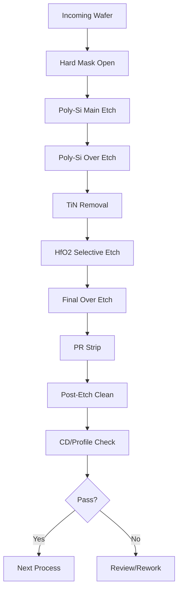

# Gate Etch 공정 사양서
## 5nm FinFET Poly-Si/High-k Metal Gate Stack Etching

**문서번호:** PS-ETCH-GATE-002-K  
**개정번호:** Rev. 2.4  
**작성일:** 2024년 11월 15일  
**보안등급:** Confidential  

---

## 1. 문서 헤더

### 승인 정보
| 역할 | 담당자 | 소속 | 서명 | 날짜 |
|------|--------|------|------|------|
| 작성 | 이준호 수석 | Etch 공정기술팀 | | |
| 검토 | 김민수 책임 | Etch 공정기술팀 | | |
| 승인 | 박상진 팀장 | 공정기술팀 | | |
| 승인 | 최유진 팀장 | 품질팀 | | |
| 승인 | 정대훈 팀장 | 생산팀 | | |

### 적용 제품
- 5nm FinFET Logic Devices
- Application Processor
- High-Performance Computing

---

## 2. 공정 개요

### 2.1 공정 목적
5nm FinFET 구조에서 gate stack (Poly-Si/TiN/HfO2) 패턴을 형성하여 트랜지스터 게이트 전극을 정의합니다.

### 2.2 핵심 사양
- **목표 CD:** 18 ± 1nm (Final gate length)
- **Profile Angle:** 88° ± 2°
- **Etch Selectivity:** Poly:HfO2 > 100:1
- **Si Loss:** < 15Å
- **Uniformity:** < 2% (3σ)
- **처리량:** 45 WPH

### 2.3 적용 장비
- **주 장비:** LAM Kiyo45 Conductor Etch System
- **Chamber Configuration:** 4-chamber cluster
- **Metrology:** CD-SEM, Cross-section SEM

---

## 3. 적용 Layer 및 제품

### 3.1 Layer Information
| Layer Code | Description | Incoming CD | Final CD | Etch Depth |
|------------|-------------|-------------|----------|------------|
| GATE_5N | Gate electrode | 23nm | 18nm | 85nm |
| DGATE_5N | Dummy gate | 25nm | 20nm | 85nm |
| FGATE_5N | Fin gate | 20nm | 15nm | 85nm |

### 3.2 Material Stack
```
Top to Bottom Structure:
├── Hard Mask (SiN): 60nm
├── Poly-Si: 80nm
├── TiN: 5nm  
├── HfO2: 2nm
├── SiO2: 0.8nm
└── Si Substrate (Fin structure)
```

---

## 4. 공정 Flow Chart



### Process Time Breakdown
| Step | Time | Cumulative |
|------|------|------------|
| Load | 15s | 15s |
| HM Open | 30s | 45s |
| Main Etch | 45s | 90s |
| Over Etch | 15s | 105s |
| TiN Clear | 10s | 115s |
| HfO2 Stop | 8s | 123s |
| Final OE | 5s | 128s |
| Unload | 12s | 140s |

---

## 5. 상세 공정 파라미터

### 5.1 Step 1: Hard Mask Open

| Parameter | Set Point | Tolerance | Unit | Note |
|-----------|-----------|-----------|------|------|
| Pressure | 8 | ± 0.5 | mTorr | |
| Source Power | 500 | ± 10 | W | 13.56 MHz |
| Bias Power | 150 | ± 5 | W | 13.56 MHz |
| CF4 Flow | 100 | ± 2 | sccm | |
| CHF3 Flow | 20 | ± 1 | sccm | |
| O2 Flow | 5 | ± 0.5 | sccm | |
| He Backside | 10 | ± 0.5 | Torr | |
| Electrode Temp | 60 | ± 2 | °C | |
| Wall Temp | 80 | ± 2 | °C | |
| Time | 30 | ± 1 | sec | |

### 5.2 Step 2: Poly-Si Main Etch

| Parameter | Set Point | Tolerance | Unit | Note |
|-----------|-----------|-----------|------|------|
| Pressure | 4 | ± 0.2 | mTorr | Critical |
| Source Power | 400 | ± 10 | W | |
| Bias Power | 100 | ± 5 | W | |
| HBr Flow | 150 | ± 3 | sccm | |
| Cl2 Flow | 50 | ± 2 | sccm | |
| O2 Flow | 3 | ± 0.3 | sccm | |
| He Backside | 15 | ± 1 | Torr | |
| Electrode Temp | 60 | ± 2 | °C | |
| Endpoint Mode | OES | - | - | 288nm |
| Endpoint Threshold | 80 | ± 5 | % | |

### 5.3 Step 3: Poly-Si Over Etch

| Parameter | Set Point | Tolerance | Unit | Note |
|-----------|-----------|-----------|------|------|
| Pressure | 6 | ± 0.3 | mTorr | |
| Source Power | 300 | ± 10 | W | |
| Bias Power | 120 | ± 5 | W | |
| HBr Flow | 180 | ± 3 | sccm | |
| O2 Flow | 5 | ± 0.5 | sccm | |
| Time | 15 | ± 1 | sec | 20% OE |

### 5.4 Step 4: TiN Removal

| Parameter | Set Point | Tolerance | Unit | Note |
|-----------|-----------|-----------|------|------|
| Pressure | 10 | ± 0.5 | mTorr | |
| Source Power | 200 | ± 10 | W | |
| Bias Power | 50 | ± 5 | W | |
| Cl2 Flow | 100 | ± 2 | sccm | |
| BCl3 Flow | 50 | ± 2 | sccm | |
| Ar Flow | 50 | ± 2 | sccm | |
| Time | 10 | ± 1 | sec | |

### 5.5 Step 5: HfO2 Selective Stop

| Parameter | Set Point | Tolerance | Unit | Note |
|-----------|-----------|-----------|------|------|
| Pressure | 20 | ± 1 | mTorr | |
| Source Power | 150 | ± 10 | W | |
| Bias Power | 20 | ± 2 | W | Low damage |
| BCl3 Flow | 100 | ± 2 | sccm | |
| Ar Flow | 100 | ± 2 | sccm | |
| Time | 8 | ± 0.5 | sec | |

### 5.6 Step 6: Final Over Etch

| Parameter | Set Point | Tolerance | Unit | Note |
|-----------|-----------|-----------|------|------|
| Pressure | 40 | ± 2 | mTorr | |
| Source Power | 100 | ± 5 | W | |
| Bias Power | 0 | - | W | Soft landing |
| HBr Flow | 50 | ± 2 | sccm | |
| He/O2 | 100/10 | ± 5 | sccm | |
| Time | 5 | ± 0.5 | sec | |

---

## 6. Critical Control Parameters

### 6.1 Key Performance Indicators (KPI)

| Parameter | Target | UCL | LCL | 측정 주기 |
|-----------|--------|-----|-----|-----------|
| Final CD | 18nm | 19nm | 17nm | 매 lot |
| CD Uniformity (3σ) | <2nm | 2.5nm | - | 매 lot |
| Profile Angle | 88° | 90° | 86° | Daily |
| Etch Depth | 85nm | 87nm | 83nm | 매 lot |
| Si Loss | <15Å | 20Å | - | Daily |
| Poly:HfO2 Selectivity | >100:1 | - | 80:1 | Weekly |

### 6.2 In-line Monitoring

| Monitor Type | Frequency | Specification | Action |
|--------------|-----------|---------------|--------|
| CD-SEM | Every lot | 18±1nm | Hold if OOS |
| Profile Check | Daily | 88°±2° | Recipe adjust |
| Particle Count | Every lot | <10 adds | Clean if >20 |
| Endpoint Trace | Every wafer | Stable signal | Review if abnormal |

### 6.3 SPC Control Strategy

```
Control Chart Configuration:
- CD Mean: X̄-R chart, n=5
- CD Range: R chart
- Etch Rate: I-MR chart  
- Profile: X̄-R chart, n=3

Western Electric Rules Applied:
- 1 point outside 3σ
- 2 of 3 outside 2σ
- 4 of 5 outside 1σ
- 8 consecutive same side
```

---

## 7. 원자재 Specification

### 7.1 Process Gases

| Gas | Grade | Purity | Impurities | 공급압력 |
|-----|-------|--------|------------|----------|
| HBr | Electronic | 99.999% | H2O <1ppm | 30 PSI |
| Cl2 | Electronic | 99.999% | H2O <1ppm | 20 PSI |
| BCl3 | Electronic | 99.999% | HCl <10ppm | 20 PSI |
| CF4 | UHP | 99.999% | H2O <1ppm | 30 PSI |
| O2 | UHP | 99.9995% | THC <0.1ppm | 60 PSI |
| He | UHP | 99.9999% | H2O <0.5ppm | 80 PSI |

### 7.2 Incoming Material Control

| Material | Check Item | Specification | Frequency |
|----------|------------|---------------|-----------|
| PR Thickness | Ellipsometer | 500±10nm | Every lot |
| Hard Mask | Thickness | 60±2nm | Every lot |
| Pattern CD | CD-SEM | 23±1nm | Sample |
| Overlay | Overlay tool | <3nm | Every lot |

---

## 8. 이상 발생 시 대응

### 8.1 CD Deviation Response

| Deviation Type | Root Cause | Immediate Action | Long-term Solution |
|---------------|------------|------------------|-------------------|
| CD > UCL | Over etch | Reduce OE time | Recipe optimization |
| CD < LCL | Under etch | Increase ME time | Endpoint tuning |
| Non-uniformity | Chamber condition | Chamber clean | Hardware check |
| CD shift | Process drift | APC adjustment | Model update |

### 8.2 Defect Response

| Defect Type | Typical Cause | Detection | Corrective Action |
|-------------|---------------|-----------|-------------------|
| Micro-loading | Pattern density | CD-SEM | Recipe modification |
| Footing | Over etch | X-SEM | Reduce bias power |
| Notching | Charge damage | X-SEM | Optimize chemistry |
| Residue | Incomplete etch | SEM | Increase OE time |
| Gate damage | High ion energy | TEM | Reduce bias |

### 8.3 Equipment Alarm Response

| Alarm Code | Description | Severity | Action |
|------------|-------------|----------|---------|
| ALM_001 | Pressure unstable | High | Check throttle valve |
| ALM_002 | RF reflected high | High | Check matching |
| ALM_003 | Endpoint not detected | Medium | Manual stop |
| ALM_004 | Temperature deviation | Low | Check cooling |
| ALM_005 | Gas flow error | High | Check MFC |

---

## 9. 참조 문서

### 9.1 관련 SOP
- SOP-ETCH-001: Kiyo45 Operation Procedure
- SOP-ETCH-002: Endpoint Detection Setup
- SOP-ETCH-003: Chamber Cleaning Procedure
- SOP-METRO-001: CD-SEM Measurement
- SOP-SAFETY-001: Gas Safety Protocol

### 9.2 기술 표준
- SEMI P39: Critical Dimension Metrology
- JEDEC JEP157: Gate Stack Reliability
- ITRS: Gate Etch Requirements

### 9.3 참고 문헌
- "Advanced Gate Etching for FinFET", IEEE 2023
- "High-k Metal Gate Integration", Symposium 2024
- LAM Kiyo45 Process Guide v3.2

---

## 10. 공정 최적화 이력

### 10.1 개선 항목

| Date | Issue | Solution | Result |
|------|-------|----------|---------|
| 2024.03 | CD uniformity | Pressure optimization | 3% → 1.8% |
| 2024.06 | Profile control | Bias pulsing | 86° → 88° |
| 2024.08 | Selectivity | Chemistry tuning | 80:1 → 110:1 |
| 2024.10 | Throughput | Endpoint optimization | 40 → 45 WPH |

### 10.2 Next Generation Planning

```
3nm Node Requirements:
- Gate CD: 12nm
- Profile: 89°±1°
- Selectivity: >150:1
- Si Loss: <10Å

Development Status:
- New chemistry evaluation
- Pulsed plasma implementation
- ALD integration planning
```

---

## Appendix A: Recipe Parameter Table

### Quick Reference Recipe Card
```
Recipe Name: GATE_ETCH_5NM_V24
Total Time: 140 seconds
Chamber: Kiyo45 Ch.A

Critical Settings:
- Pressure: 4-40 mTorr range
- Power: 100-500W source
- Temperature: 60°C electrode
- Chemistry: HBr/Cl2 based
```

---

## Appendix B: Troubleshooting Matrix

| Symptom | Probable Cause | Verification | Solution |
|---------|---------------|--------------|----------|
| CD large | Over etch | Check time | Reduce OE |
| CD small | Endpoint early | Check signal | Adjust threshold |
| Poor profile | Ion angle | Check bias | Optimize power |
| Residue | Incomplete | Visual/SEM | Increase time |
| Damage | High energy | TEM | Reduce bias |

---

**문서 관리:**
- 차기 검토일: 2025년 2월 15일
- 문서 관리: Etch 공정기술팀
- 배포: MES System upload