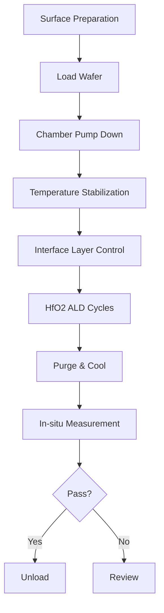

# ALD High-k Dielectric 공정 사양서
## 3nm FinFET HfO2 Gate Dielectric Deposition

**문서번호:** PS-ALD-HK-004-K  
**개정번호:** Rev. 2.1  
**작성일:** 2024년 11월 15일  
**보안등급:** Confidential  

---

## 1. 문서 헤더

### 승인 정보
| 역할 | 담당자 | 소속 | 서명 | 날짜 |
|------|--------|------|------|------|
| 작성 | 윤성호 책임 | Thin Film 공정팀 | | |
| 검토 | 백승현 수석 | 공정개발팀 | | |
| 승인 | 황정민 팀장 | 공정기술팀 | | |
| 승인 | 김영희 팀장 | 품질팀 | | |
| 승인 | 이준석 팀장 | 생산팀 | | |

---

## 2. 공정 개요

### 2.1 공정 목적
3nm FinFET transistor의 gate dielectric으로 high-k material인 HfO2 박막을 원자층 증착법으로 형성

### 2.2 주요 사양
- **Target EOT:** 0.8 ± 0.05nm
- **Physical Thickness:** 2.0 ± 0.1nm
- **Uniformity (WiW):** < 1.5% (1σ)
- **Leakage Current:** < 1E-2 A/cm² @ 1V
- **Interface Layer:** < 0.5nm SiO2
- **처리량:** 25 WPH

### 2.3 적용 장비
- **ALD System:** ASM Polygon 8300
- **Chamber:** Single wafer processing
- **In-situ Metrology:** Ellipsometer integrated

---

## 3. Material Stack Structure

```
Gate Stack (Top to Bottom):
┌─────────────┐
│   TiN (2nm) │ ← Metal Gate (Next process)
├─────────────┤
│  HfO2 (2nm) │ ← This process
├─────────────┤
│ SiO2 (0.3nm)│ ← Interface layer
├─────────────┤
│ Si Channel  │ ← Substrate
└─────────────┘
```

---

## 4. 공정 Flow Chart



---

## 5. 상세 공정 파라미터

### 5.1 Pre-deposition Parameters

| Parameter | Set Point | Tolerance | Unit | Critical |
|-----------|-----------|-----------|------|----------|
| Base Pressure | 1E-7 | < 5E-7 | Torr | Yes |
| Substrate Temp | 300 | ± 5 | °C | Yes |
| Stabilization Time | 60 | ± 5 | sec | No |
| N2 Purge Flow | 500 | ± 10 | sccm | No |

### 5.2 ALD Cycle Parameters

#### Precursor Pulse Sequence
| Step | Chemical | Time (s) | Flow (sccm) | Pressure (Torr) |
|------|----------|----------|-------------|-----------------|
| 1 | HfCl4 pulse | 0.15 | 50 | 1.0 ± 0.1 |
| 2 | N2 purge | 3.0 | 1000 | 1.0 ± 0.1 |
| 3 | H2O pulse | 0.10 | 20 | 1.0 ± 0.1 |
| 4 | N2 purge | 3.0 | 1000 | 1.0 ± 0.1 |

**Total Cycle Time:** 6.25 seconds  
**Growth Rate:** 1.0 ± 0.05 Å/cycle  
**Number of Cycles:** 20 cycles (for 2.0nm)

### 5.3 Process Chemistry

```
ALD Reactions:
Surface-OH + HfCl4 → Surface-O-HfCl3 + HCl
Surface-HfCl3 + H2O → Surface-HfOH + HCl

Key Parameters:
- Precursor Temperature: HfCl4 @ 120°C
- H2O Temperature: 25°C
- Purge Efficiency: > 99.9%
- Surface Saturation: Complete
```

---

## 6. Critical Control Parameters

### 6.1 Key Performance Indicators

| Parameter | Target | UCL | LCL | 측정 빈도 |
|-----------|--------|-----|-----|-----------|
| EOT | 0.8nm | 0.85nm | 0.75nm | Every wafer |
| Physical Thickness | 2.0nm | 2.1nm | 1.9nm | Every wafer |
| Uniformity (49pt) | <1.5% | 2.0% | - | Every lot |
| Leakage @ 1V | <1E-2 A/cm² | 1E-2 | - | Sample |
| k-value | 22 ± 2 | 24 | 20 | Daily |
| Interface Thickness | <0.5nm | 0.6nm | - | Daily |

### 6.2 In-line Monitoring Points

| Monitor Type | Method | Frequency | Action Limit |
|--------------|--------|-----------|--------------|
| Thickness | Ellipsometer | 100% | ± 1Å |
| EOT | C-V measurement | Sample | ± 0.5Å |
| Contamination | TXRF | Daily | <1E10 at/cm² |
| Composition | XPS | Weekly | Hf:O = 1:2±0.1 |
| Crystal Structure | XRD | Weekly | Monoclinic |

### 6.3 SPC Implementation

```
Control Charts:
- Thickness: X̄-R chart (n=5)
- EOT: I-MR chart
- Uniformity: I-chart (UCL only)
- Leakage: Log scale I-chart

Process Capability Targets:
- Thickness Cpk > 2.0
- EOT Cpk > 1.67
- Uniformity Cp > 2.0
```

---

## 7. 원자재 Specification

### 7.1 Precursor Requirements

| Material | Specification | Purity | Supplier |
|----------|---------------|---------|----------|
| HfCl4 | Electronic grade | >99.99% | Sigma-Aldrich |
| H2O | VLSI grade | 18.2 MΩ·cm | In-house |
| N2 (Purge) | UHP | >99.9999% | Air Liquide |
| N2 (Carrier) | UHP | >99.9999% | Air Liquide |

### 7.2 Incoming Quality Control

| Check Item | Method | Specification | Frequency |
|------------|--------|---------------|-----------|
| HfCl4 Purity | ICP-MS | Metal <1ppb | Every bottle |
| H2O Resistivity | Inline monitor | >18 MΩ·cm | Continuous |
| Particle Count | Particle counter | <1/mL @ 0.05µm | Daily |
| TOC | TOC analyzer | <1ppb | Daily |

---

## 8. 이상 발생 시 대응

### 8.1 Thickness Deviation

| Issue | Root Cause | Verification | Action |
|-------|------------|--------------|---------|
| Thickness High | Extra cycles | Check counter | Reduce cycles |
| Thickness Low | Incomplete saturation | Pulse time | Increase pulse |
| Non-uniformity | Temperature gradient | Map temperature | Adjust zones |
| Batch variation | Precursor depletion | Check source | Replace precursor |

### 8.2 Electrical Property Issues

| Issue | Typical Cause | Detection | Solution |
|-------|---------------|-----------|----------|
| High leakage | Pinholes | C-V test | Check particles |
| Low k-value | Contamination | XPS | Chamber clean |
| High EOT | Interface growth | TEM | Reduce O2 exposure |
| Vfb shift | Fixed charge | C-V | Process optimization |

### 8.3 Equipment Alarms

| Alarm | Description | Impact | Response |
|-------|-------------|---------|----------|
| PR_01 | Low precursor | Process stop | Replace bottle |
| TM_01 | Temperature deviation | Quality risk | Check heaters |
| VA_01 | Vacuum leak | Contamination | Find leak |
| FL_01 | MFC error | Incorrect recipe | Calibrate MFC |

---

## 9. 참조 문서

### 9.1 관련 표준 및 절차
- SOP-ALD-001: Polygon 8300 Operation
- SOP-METRO-002: Ellipsometer Measurement
- SOP-ELEC-001: C-V Measurement
- QC-SPEC-001: High-k Quality Specification
- SAFE-CHEM-001: HfCl4 Handling

### 9.2 기술 문헌
- ITRS Roadmap: Gate Stack Requirements
- IEEE IEDM: High-k Gate Dielectrics
- Journal of Applied Physics: HfO2 ALD

---

## 10. 개정 이력

| Rev | Date | Description | Author |
|-----|------|-------------|--------|
| 1.0 | 2024.01.15 | Initial release | Y.S.H |
| 1.1 | 2024.04.20 | Update temperature | B.S.H |
| 2.0 | 2024.08.10 | 3nm process update | Y.S.H |
| 2.1 | 2024.11.15 | Cycle optimization | Y.S.H |

---

## Appendix A: Process Window

### Temperature Window
```
Temperature (°C)  Growth Rate (Å/cycle)  Quality
250-270          0.8-0.9               Poor (incomplete)
280-320          1.0-1.1               Optimal
330-350          1.1-1.3               Acceptable
>350             CVD regime            Unacceptable
```

### Pulse Time Window
```
HfCl4 Pulse (s)   Saturation    Thickness Uniformity
<0.1              Incomplete    >3%
0.1-0.2           Complete      <1.5%
>0.3              Excess        Particle risk
```

---

## Appendix B: Troubleshooting Guide

| Symptom | Check | Action |
|---------|-------|--------|
| Thickness drift | Precursor level | Replace if <20% |
| Poor uniformity | Temperature map | Adjust heater zones |
| Particles | Chamber condition | Wet clean |
| High leakage | Contamination | Check all sources |
| Low throughput | Cycle time | Optimize purge |

---

**문서 관리:**
- 관리부서: Thin Film 공정팀
- 다음 검토: 2025년 2월 15일
- 배포: MES 시스템